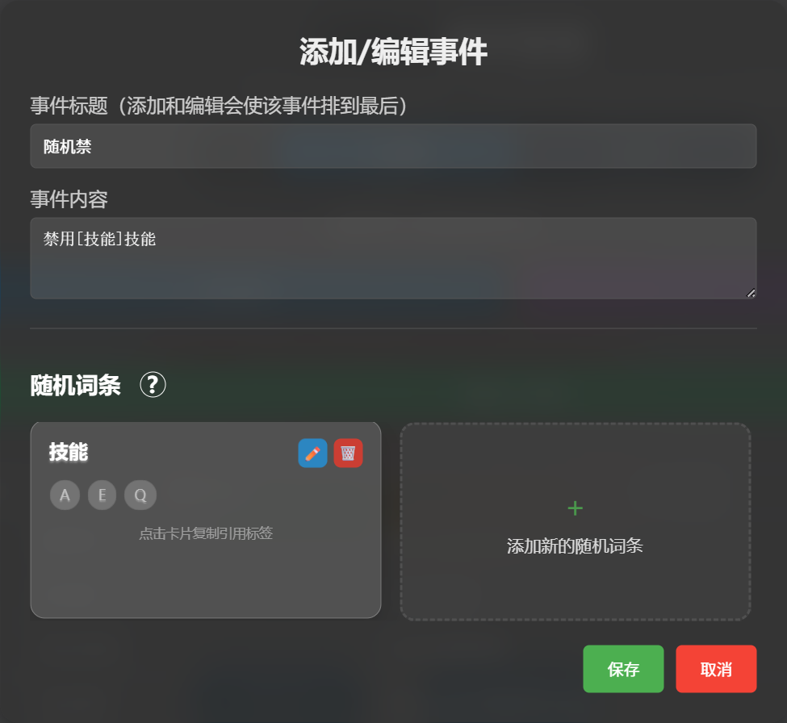
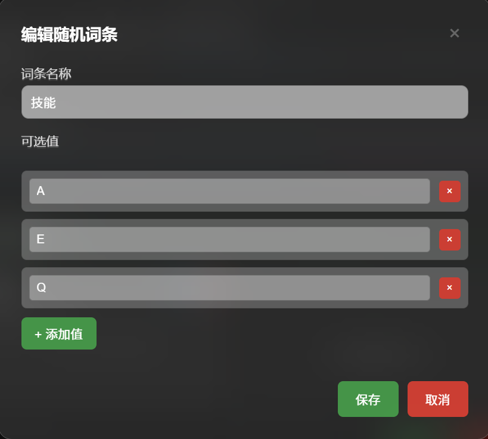
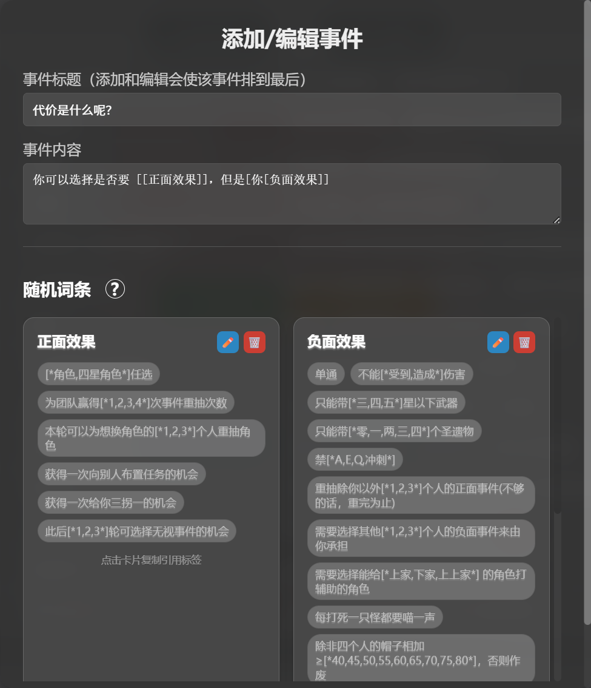
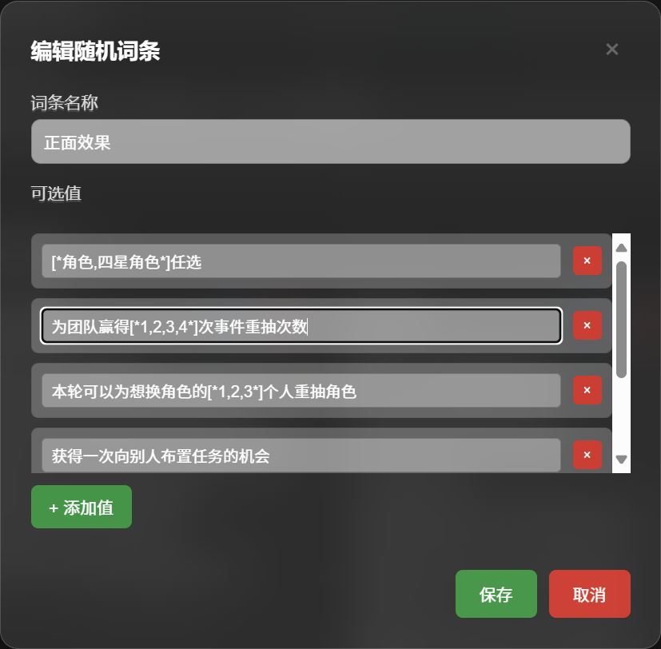

# 详细指南

本部分将深入介绍 UnhappyCar 的各项核心功能，帮助您充分利用其所有特性。

---

## 🎭 角色抽取系统

角色抽取是游戏的核心环节。系统提供了多种模式和机制，以确保游戏的公平性、策略性和趣味性。

### BP模式说明

在开始游戏前，主持人可以选择不同的BP模式来决定角色池的运作方式。

*   **全局BP模式 (Global)**
    *   **机制**：所有玩家共享一个已使用的角色列表。一旦某个角色被任何玩家抽中，其他所有玩家在本轮及后续轮次中都无法再次抽到该角色。

*   **个人BP模式 (Personal)**
    *   **机制**：每个玩家（1P, 2P, 3P, 4P）都拥有自己独立的已使用角色列表。不同玩家之间可以抽到相同的角色，但每个玩家自己不会重复抽到已使用过的角色。

*   **关闭BP模式 (Off)**
    *   **机制**：完全随机，不记录任何已使用角色。每轮抽取都是从完整的可用角色池中进行。

> **💡 屏蔽机制**: 在任何模式下，如果您通过**点击角色卡片**的方式进行**单点重抽**，那么被替换掉的那个角色将被视为“该玩家不拥有此角色”，并加入该玩家的**个人屏蔽列表**。此后，该玩家将永远不会再抽到这个被屏蔽的角色，除非重置游戏。

### 抽取与重抽

*   **开始抽取**: 点击主界面的“开始抽取”按钮，为所有玩家位置随机分配角色。
*   **单点重抽**: 游戏开始后，直接点击任意一个角色卡片，可以为该位置重新抽取一个新角色。

---

## ⚔️ 阵容模式系统

阵容模式允许您预设多套角色阵容，并在游戏中直接抽取一整套阵容。

### 启用阵容模式

1.  点击主界面右下角的 **设置** 按钮。
2.  在设置菜单中选择 **更多玩法设置**。
3.  找到 **阵容模式** 开关并启用它。
4.  启用后，BP模式按钮将自动隐藏，主界面的“开始抽取”按钮会变为“阵容抽取”。

> **⚠️注意**: 阵容模式下，抽取将完全基于您设置的阵容，会忽略BP模式和您在“角色管理”中的禁用设置。

### 阵容管理

在“更多玩法设置”中，您可以对阵容进行全面的管理：

*   **创建新阵容**:
    1.  点击阵容列表右上角的 **+** 按钮。
    2.  为您的阵容输入一个独特的**名称**。
    3.  从下方的角色池中选择 **4** 个角色。
    4.  点击 **保存**。

*   **编辑与删除**:
    *   点击任意阵容卡片上的 **编辑** 按钮，可以修改其名称和角色配置。
    *   点击 **删除** 按钮可以永久移除该阵容。

*   **导入/导出/重置**:
    *   **导出**: 将您当前的所有阵容配置保存为一个 `.json` 文件，方便备份或与他人分享。
    *   **导入**: 通过选择一个 `.json` 文件，快速导入他人分享或您之前备份的阵容配置。
    *   **恢复初始状态**: 将阵容列表重置为游戏预设的几套默认阵容。

### 可替换角色系统

为了增加阵容的灵活性，您可以为某个位置设置一个“可替换角色”。

*   **设置方法**:
    1.  在阵容编辑界面，**右键点击**一个已经选入上方“已选择角色”区域的**单个角色**。
    2.  此时界面会进入“替代角色选择模式”。
    3.  从下方的角色池中选择另一个角色作为其替代。
    4.  设置成功后，该角色位置会显示为两个角色的**分割头像**。
---

## 📝 事件系统

事件系统为游戏增加了丰富多样的任务和挑战，分为“个人事件”和“团体事件”。

### 事件抽取

*   **个人事件**: 点击主界面的“抽取事件”按钮，会为每个玩家抽取一个个人事件。
*   **团体事件**: 抽取个人事件后，系统会自动抽出三个备选的团体事件，供所有玩家投票选择。

### 重抽次数系统

这是一个全队共享的资源，用于增加游戏的策略性和容错性。

*   **用途**: 主要用于**重抽个人事件**。点击不喜欢的个人事件卡片，即可消耗1次重抽机会，换一个新的事件。
*   **获取方式**:
    *   **初始**: 每次游戏开始或重置时，队伍获得 **3** 次重抽机会。
    *   **动态获取**: 每次抽取个人事件时，都有一定概率（初始为5%，随连续未触发而增加）触发重抽次数变化事件，结果可能为 `+1` 或 `-1`。系统有保护机制，避免连续多次 `-1`。
*   **手动调整**: 主持人可以通过重抽计数器旁的 `+` 和 `-` 按钮手动调整次数，以应对某些特殊事件的效果。

### 团体事件投票

*   **机制**:
    *   系统随机抽取 **3** 个团体事件作为候选。
    *   所有玩家都可以点击自己喜欢的事件卡片进行投票。
    *   **主持人拥有 2 票权重**，其他玩家均为 1 票。
    *   投票结束后，得票最高的事件成为本轮的团体任务。
    *   如果出现平票，系统将从平票的事件中**随机选择一个**。

---
### 随机词条

随机词条允许您在事件描述中插入可变的元素，让事件内容更加动态和不可预测。

*   **基本原理**
    *   您可以定义一个“词条”（例如，命名为 `技能`），并为它提供一个词语列表（例如 `["A", "E", "Q"]`）。
    *   在事件的“内容”中，您可以使用 `[技能]` 这样的标签来引用这个词条。
    *   当游戏抽取到这个事件时，系统会自动从 `["A", "E", "Q"]` 列表中随机选择一个词，并替换掉内容中的 `[技能]` 标签。
*   **如何创建和使用**
    1.  在 **设置 -> 事件管理** 中，点击“添加个人/团队事件”或编辑一个现有事件。
    2.  在弹出的编辑窗口中，找到“随机词条”区域。
    3.  点击 **“+ 添加新的随机词条”** 卡片。
    4.  在弹出的“添加随机词条”窗口中：
        *   输入**词条名称**（例如 `技能`）。
        *   在下方的输入框中添加至少一个**词条值**（例如 `A E Q`）。您可以点击“添加一个新词条”来增加更多选项。
        *   点击 **保存**。
    5.  创建成功后，您会看到一个代表该词条的卡片。**点击这张卡片**，系统会自动将引用标签（如 `[技能]`）复制到您的剪贴板。
    6.  回到上方的“事件内容”输入框，将复制的标签粘贴到您希望它出现的位置。例如：“禁用[技能]技能”
    7.  保存整个事件。
    <table>
    <tr>
        <td></td>
        <td></td>
    </tr>
    </table>
*   **嵌套随机**
    *   您还可以在一个词条值中使用 `[*xx,yy,zz*]` 格式来实现嵌套随机，以实现更复杂的随机。
    *   例如，如图所示，“为队伍赢得`[*1,2,3,4*]`次事件重抽次数”`[*1,2,3,4*]`将随机替换为 `1`、`2`、`3` 或 `4`。
    *   注意：符号需使用英文符号。
    <table>
    <tr>
        <td></td>
        <td></td>
    </tr>
    </table>
---
## 🌐 事件创意工坊 (共享事件)

这是一个在线社区功能，允许您下载他人分享的自定义事件，也可以将自己的创意分享给所有人。

### 浏览与下载

1.  在 **设置 -> 事件创意工坊** 中，您可以看到社区分享的所有事件。
2.  事件卡片会显示其状态：
    *   **未添加**: 您本地没有这个事件。
    *   **已添加**: 您本地已有这个事件，且内容完全相同。
    *   **内容冲突**: 您本地有同名事件，但内容不同。
3.  点击“添加”按钮即可将事件下载到您本地的事件库中。
4.  对于“内容冲突”的事件，系统会提示您选择**覆盖本地版本**或**重命名后添加**。

### 分享与管理

*   **分享我的事件库**:
    1.  点击“分享我的事件库”按钮。
    2.  选择您想要分享的个人和团队事件。
    3.  输入一个**显示的名字**和**识别码**（请牢记，这是您管理自己分享库的凭证）。
    4.  点击“确认并上传”。

*   **管理我的分享库**:
    1.  点击“管理我的分享库”按钮。
    2.  输入您之前使用的**名字**和**识别码**进行验证。
    3.  验证成功后，您可以查看并**删除**您已分享的任何事件。